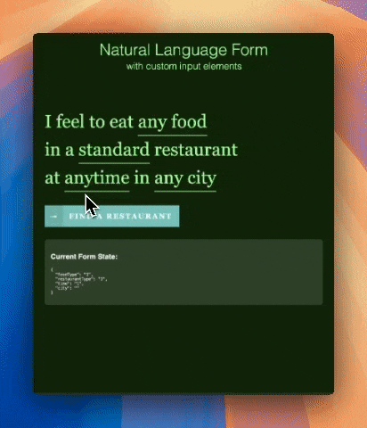

# React NLForm

A React component library for creating natural language forms with interactive dropdowns and inputs.



[](https://badge.fury.io/js/react-nlform)
[](https://opensource.org/licenses/MIT)

## Installation

```bash
npm install react-nlform
# or
yarn add react-nlform
```

## Quick Start

```jsx
import React, { useState } from 'react';
import { NLForm, NLSelect, NLInput } from 'react-nlform';

function App() {
  const [formData, setFormData] = useState({
    foodType: '1',
    city: ''
  });

  const foodOptions = [
    { value: '1', label: 'any food' },
    { value: '2', label: 'Italian' },
    { value: '3', label: 'Japanese' }
  ];

  const handleSubmit = (e) => {
    e.preventDefault();
    console.log('Form data:', formData);
  };

  return (
    <NLForm onSubmit={handleSubmit}>
      I feel to eat{' '}
      <NLSelect 
        options={foodOptions}
        value={formData.foodType}
        onChange={(value) => setFormData(prev => ({ ...prev, foodType: value }))}
      />
      <br />
      in{' '}
      <NLInput
        type="text"
        placeholder="any city"
        value={formData.city}
        onChange={(value) => setFormData(prev => ({ ...prev, city: value }))}
        subline="For example: <em>Los Angeles</em> or <em>New York</em>"
      />
      <div className="nl-submit-wrap">
        <button className="nl-submit" type="submit">
          Find a restaurant
        </button>
      </div>
    </NLForm>
  );
}
```

## Components API

### NLForm

The main container component for natural language forms.

**Props:**
- `onSubmit?: (event: FormEvent) => void` - Form submission handler
- `className?: string` - Custom CSS class (default: 'nl-form')
- `children: ReactNode` - Form content

**Example:**
```jsx
<NLForm onSubmit={handleSubmit} className="my-form">
  {/* Your form content */}
</NLForm>
```

### NLSelect

Interactive dropdown component for selecting from predefined options.

**Props:**
- `options: Option[]` - Array of `{value: string, label: string}` objects
- `value?: string` - Currently selected value
- `onChange: (value: string, label: string) => void` - Selection change handler
- `className?: string` - Custom CSS class

**Example:**
```jsx
const options = [
  { value: '1', label: 'Option 1' },
  { value: '2', label: 'Option 2' }
];

<NLSelect
  options={options}
  value={selectedValue}
  onChange={(value, label) => {
    console.log('Selected:', { value, label });
    setSelectedValue(value);
  }}
/>
```

### NLInput

Interactive text input component with expandable interface.

**Props:**
- `type?: string` - Input type (default: 'text')
- `value?: string` - Current input value
- `placeholder?: string` - Placeholder text
- `subline?: string` - Helper text below input (supports HTML)
- `onChange: (value: string) => void` - Value change handler
- `className?: string` - Custom CSS class

**Example:**
```jsx
<NLInput
  type="text"
  placeholder="Enter your location"
  value={location}
  onChange={setLocation}
  subline="For example: <em>San Francisco</em> or <em>New York</em>"
/>
```

## Theme Customization

React NLForm includes a powerful theme system for complete styling control.

### NLThemeProvider

Wrap your components with `NLThemeProvider` to apply custom themes:

```jsx
import { NLForm, NLSelect, NLInput, NLThemeProvider } from 'react-nlform';

const customTheme = {
  form: {
    fontSize: '2.5em',
    fontFamily: 'Georgia, serif',
  },
  fieldToggle: {
    color: '#0066cc',
    borderBottom: '2px solid #0066cc',
  },
  optionsList: {
    background: '#2c3e50',
    borderRadius: '8px',
    boxShadow: '0 4px 12px rgba(0,0,0,0.2)',
  },
  optionItem: {
    color: '#ecf0f1',
    padding: '0.75rem 1.5rem',
  },
  submitButton: {
    background: '#27ae60',
    borderRadius: '6px',
  },
};

function App() {
  return (
    <NLThemeProvider theme={customTheme}>
      <NLForm>
        {/* Your form components */}
      </NLForm>
    </NLThemeProvider>
  );
}
```

### Theme Configuration

The theme object supports the following properties:

```typescript
interface NLTheme {
  form: {
    fontSize?: string;
    lineHeight?: string | number;
    fontFamily?: string;
    fontWeight?: string | number;
    width?: string;
    margin?: string;
  };
  fieldToggle: {
    color?: string;
    cursor?: string;
    borderBottom?: string;
    textDecoration?: string;
    padding?: string;
    background?: string;
  };
  optionsList: {
    background?: string;
    border?: string;
    borderRadius?: string;
    boxShadow?: string;
    fontSize?: string;
    minWidth?: string;
    zIndex?: number;
  };
  optionItem: {
    color?: string;
    padding?: string;
    cursor?: string;
    backgroundColor?: string;
    hoverBackgroundColor?: string;
    checkedColor?: string;
  };
  input: {
    width?: string;
    padding?: string;
    border?: string;
    borderRadius?: string;
    fontSize?: string;
    color?: string;
    backgroundColor?: string;
  };
  submitButton: {
    background?: string;
    color?: string;
    padding?: string;
    fontSize?: string;
    fontWeight?: string | number;
    borderRadius?: string;
  };
  // ... and more
}
```

### Using Default Theme

Import and extend the default theme:

```jsx
import { defaultTheme, NLThemeProvider } from 'react-nlform';

const myTheme = {
  ...defaultTheme,
  fieldToggle: {
    ...defaultTheme.fieldToggle,
    color: '#e74c3c',
  },
};
```

## Advanced Usage

### Complete Restaurant Finder Example

```jsx
import React, { useState } from 'react';
import { NLForm, NLSelect, NLInput, NLThemeProvider } from 'react-nlform';

function RestaurantFinder() {
  const [formData, setFormData] = useState({
    foodType: '1',
    restaurantType: '1',
    time: '1',
    city: ''
  });

  const foodOptions = [
    { value: '1', label: 'any food' },
    { value: '2', label: 'Indian' },
    { value: '3', label: 'French' },
    { value: '4', label: 'Japanese' },
    { value: '5', label: 'Italian' }
  ];

  const restaurantOptions = [
    { value: '1', label: 'standard' },
    { value: '2', label: 'fancy' },
    { value: '3', label: 'casual' },
    { value: '4', label: 'romantic' }
  ];

  const timeOptions = [
    { value: '1', label: 'anytime' },
    { value: '2', label: '7 p.m.' },
    { value: '3', label: '8 p.m.' },
    { value: '4', label: '9 p.m.' }
  ];

  const customTheme = {
    form: {
      fontSize: '3em',
      fontFamily: 'Arial, sans-serif',
    },
    fieldToggle: {
      color: '#3498db',
      borderBottom: '2px solid #3498db',
    },
    optionsList: {
      background: '#34495e',
      borderRadius: '8px',
    },
    optionItem: {
      color: '#ecf0f1',
      checkedColor: '#f39c12',
    },
  };

  const handleSubmit = (e) => {
    e.preventDefault();
    console.log('Restaurant preferences:', formData);
    // Handle form submission
  };

  return (
    <NLThemeProvider theme={customTheme}>
      <NLForm onSubmit={handleSubmit}>
        I feel to eat{' '}
        <NLSelect 
          options={foodOptions}
          value={formData.foodType}
          onChange={(value) => setFormData(prev => ({ ...prev, foodType: value }))}
        />
        <br />
        in a{' '}
        <NLSelect 
          options={restaurantOptions}
          value={formData.restaurantType}
          onChange={(value) => setFormData(prev => ({ ...prev, restaurantType: value }))}
        />
        {' '}restaurant
        <br />
        at{' '}
        <NLSelect 
          options={timeOptions}
          value={formData.time}
          onChange={(value) => setFormData(prev => ({ ...prev, time: value }))}
        />
        {' '}in{' '}
        <NLInput
          type="text"
          value={formData.city}
          placeholder="any city"
          subline="For example: <em>Los Angeles</em> or <em>New York</em>"
          onChange={(value) => setFormData(prev => ({ ...prev, city: value }))}
        />
        <div className="nl-submit-wrap">
          <button className="nl-submit" type="submit">
            Find a restaurant
          </button>
        </div>
      </NLForm>
    </NLThemeProvider>
  );
}
```

## Features

- 🎯 **Natural Language Interface** - Create forms that read like sentences
- 🎨 **Fully Customizable Themes** - Complete control over styling with theme provider
- 📱 **Mobile Friendly** - Touch-optimized interactions
- ♿ **Accessible** - Keyboard navigation and screen reader support
- 🔧 **TypeScript Support** - Full type definitions included
- 🪶 **Lightweight** - Minimal bundle size impact
- ⚡ **Easy Integration** - Works with any React setup

## Browser Support

- Chrome (latest)
- Firefox (latest)
- Safari (latest)
- Edge (latest)

## TypeScript

All components and themes are fully typed. Import types as needed:

```typescript
import { NLTheme, NLFormProps, NLSelectProps, NLInputProps, Option } from 'react-nlform';
```

## License

MIT © Hypercard Limited Liability Co.

## Credits

Inspired by the original [NLForm](http://tympanus.net/codrops/?p=15139) by Codrops, reimagined for React with modern theming capabilities.